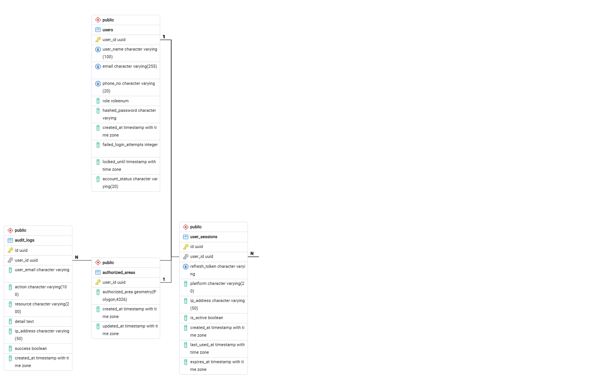

# Area Authorization System — Project Documentation

## 1. Project Overview

This project implements a **role-based access control (RBAC) system** for assigning and managing geographic "authorized areas" to users. It consists of:

- A **backend API** (originally two separate FastAPI microservices — `auth-api` and `area-api` — later merged into a single **`combined-api`**)
- A **PostgreSQL + PostGIS** database for storing users, sessions, audit logs, and geospatial area data
- A **React (Vite) frontend** for registration, login, and viewing/managing assigned areas

The system supports two user roles: **Admin** and **Viewer** (a third role, **Editor**, was initially included and later removed due to redundancy).

---

## 2. Architecture Evolution

### 2.1 Initial Design — Two Separate Microservices
- **auth-api** (port 8000): handled registration, login, JWT issuance, sessions, password management.
- **area-api** (port 8001): handled assigning, viewing, and checking geographic areas for users.
- Each service had its **own PostgreSQL database** (`auth_db` and `area_db`).
- Because the two services didn't share a database, `area-api` could not maintain a real foreign key to the `users` table. It instead used a **`user_references`** cache table to mirror minimal user data (`user_id`, `role`, `is_active`) needed for authorization checks.

### 2.2 Final Design — Merged into a Single Service (`combined-api`)
To eliminate the data-sync problems and redundant cache table, both services were merged into one FastAPI application:
- Single port (`8000`)
- Single database (`auth_db`)
- Single `.env` and `SECRET_KEY`/`ACCESS_TOKEN_SECRET`
- The `user_references` cache table was replaced by a proper **`authorized_areas`** table with a real foreign key to `users.user_id` (`ON DELETE CASCADE`)
- `dependencies.py`, `areas.py`, and `auth.py` were consolidated into one shared codebase

**Folder structure (combined-api):**
```
combined-api/
├── .env
├── requirements.txt
└── app/
    ├── main.py
    ├── core/
    │   ├── config.py
    │   ├── security.py
    │   ├── dependencies.py
    │   ├── audit_logger.py
    │   ├── audit_actions.py
    │   ├── geo_utils.py
    │   └── request_utils.py
    ├── db/
    │   └── session.py
    ├── models/
    │   ├── user.py
    │   ├── session.py
    │   ├── authorized_area.py
    │   ├── survey_record.py
    │   └── audit_log.py
    ├── schemas/
    │   ├── auth.py
    │   ├── area.py
    │   └── survey.py
    └── routers/
        ├── auth.py
        ├── areas.py
        └── surveys.py
```

---

## 3. Database Schema

### 3.0 Entity-Relationship Diagram



The diagram above shows the four core tables and their relationships:
- **`users` → `audit_logs`** (1-to-N): one user can generate many audit log entries.
- **`users` → `authorized_areas`** (1-to-1): each user has at most one assigned authorized area, enforced via a foreign key on `authorized_areas.user_id` referencing `users.user_id`.
- **`users` → `user_sessions`** (1-to-N): one user can have many active login sessions (one per device/login).

### 3.1 `users` table
| Column | Type | Notes |
|---|---|---|
| user_id | UUID (PK) | |
| user_name | String, unique | |
| email | String, unique | |
| phone_no | String, unique | |
| role | Enum: `admin`, `viewer` | Editor role removed |
| hashed_password | String | |
| account_status | Enum: `ACTIVATED`, `DEACTIVATED` | Replaced original `is_active` boolean |
| created_at | Timestamp | |
| failed_login_attempts | Integer | |
| locked_until | Timestamp (nullable) | |

### 3.2 `authorized_areas` table
| Column | Type | Notes |
|---|---|---|
| user_id | UUID (PK, FK → users.user_id, ON DELETE CASCADE) | One area per user |
| authorized_area | Geometry(POLYGON, 4326) | PostGIS polygon |
| created_at | Timestamptz | |
| updated_at | Timestamptz | |

### 3.3 `audit_logs` table
| Column | Type | Notes |
|---|---|---|
| id | UUID (PK) | |
| user_id | UUID (nullable) | No FK — service-level trust via verified JWT |
| user_email | String (nullable) | |
| action | String(100) | e.g. LOGIN_SUCCESS, ASSIGN_USER_AREA |
| resource | String(200) | |
| detail | Text | |
| ip_address | String(50) | |
| success | Boolean | |
| created_at | Timestamptz | |

### 3.4 `sessions` table (UserSession)
Stores refresh tokens, platform, IP, and expiry per login session, supporting logout / logout-all / session listing. The foreign key to `users.user_id` now cascades on delete, so removing a user cleans up their sessions automatically instead of leaving orphaned rows.

### 3.5 `survey_records` table (SurveyRecord)
| Column | Type | Notes |
|---|---|---|
| id | UUID (PK) | |
| user_id | UUID (FK → users.user_id, ON DELETE CASCADE) | Owner of the survey |
| geometry | Geometry(POLYGON, 4326) | PostGIS polygon, mirrors `authorized_areas` |
| village | String(200) | |
| plot | String(100) | |
| timestamp | Timestamptz | Set on creation |
| verified_status | Boolean | Defaults to `false`; toggled via the verify endpoint |

Unlike `authorized_areas`, a user can have **many** survey records (no unique constraint on `user_id`).

---

## 4. Authentication & Authorization

- **JWT-based authentication** using `python-jose`, with separate secrets for access and refresh tokens (`ACCESS_TOKEN_SECRET`, `REFRESH_TOKEN_SECRET`).
- Access tokens embed: `sub` (user_id), `type`, `role`, `is_active`/`account_status`, `exp`.
- **`get_current_user`** dependency decodes the token, re-fetches the user from the database on **every request**, and rejects the request immediately if `account_status != ACTIVATED` — meaning admin deactivation takes effect instantly, even on a still-valid token, not just on the next login attempt.
- **`require_role(*roles)`** dependency factory enforces role-based access on specific endpoints.
- **Response schemas:** `/auth/me` and `/auth/users` now declare explicit Pydantic response models (`UserProfileResponse`, `UserListItemResponse` in `app/schemas/auth.py`) instead of returning raw dicts, so FastAPI validates and documents the response shape in the OpenAPI schema.
- **Account lockout**: 5 failed login attempts locks the account for 5 minutes (`locked_until`), with an admin-only `/unlock/{user_id}` endpoint to manually clear it.

### 4.1 Role Permissions Summary

| Action | Admin | Viewer |
|---|---|---|
| Register / Login | ✅ | ✅ |
| View own profile (`/me`) | ✅ | ✅ |
| View own assigned area | ✅ | ✅ |
| View another user's assigned area | ✅ | ❌ |
| Assign / update an area for any user | ✅ | ❌ |
| Assign / update their own area | ✅ | ✅ |
| Delete an assigned area (own) | ✅ | ✅ |
| Delete another user's assigned area | ✅ | ❌ |
| Activate / deactivate other accounts | ✅ | ❌ |
| View audit logs | ✅ | ❌ |
| Run "is my location inside my area" check | ✅ | ✅ |

**Note:** Viewers can create, update, and delete **their own** authorized area — this matches the frontend, which lets every logged-in user manage only their own area with no separate admin UI. Viewers still cannot view, assign, or delete another user's area; only an Admin has cross-user access.

---

## 5. API Endpoints

### 5.1 Auth (`/api/v1/auth`)
| Method | Path | Access | Purpose |
|---|---|---|---|
| POST | `/register` | Public | Create account (role specified at registration: admin or viewer) |
| POST | `/login` | Public | Authenticate, returns access + refresh tokens |
| POST | `/refresh` | Public (valid refresh token) | Issue new access token |
| POST | `/logout` | Authenticated | Invalidate one session |
| POST | `/logout-all` | Authenticated | Invalidate all sessions |
| GET | `/sessions` | Authenticated | List active sessions |
| GET | `/me` | Authenticated | Get own profile |
| PUT | `/me` | Authenticated | Update own phone number |
| PUT | `/me/password` | Authenticated | Change own password |
| POST | `/unlock/{user_id}` | Admin only | Clear failed-login lockout |
| PUT | `/users/{user_id}/status` | Admin only | Activate/deactivate another user's account |

### 5.2 Areas (`/api/v1/areas`)
| Method | Path | Access | Purpose |
|---|---|---|---|
| PUT | `/users/{user_id}` | Self or Admin | Assign or update a user's authorized area |
| DELETE | `/users/{user_id}` | Self or Admin | Remove a user's authorized area |
| GET | `/users/{user_id}` | Self or Admin | View an assigned area |
| POST | `/check-point` | Authenticated | Check if a coordinate falls inside the caller's own assigned area |
| GET | `/audit` | Admin only | View paginated audit log entries |

### 5.3 Survey Records (`/api/v1/surveys`)
A new resource distinct from `authorized_areas`: a user can have **multiple** survey records (one per plot surveyed), each with its own polygon, village/plot labels, and an admin-controlled verification flag.

| Method | Path | Access | Purpose |
|---|---|---|---|
| POST | `` | Admin only | Create a survey record for a given user |
| GET | `` | Admin only | List all survey records (paginated via `limit`/`offset`) |
| GET | `/my` | Authenticated | List the caller's own survey records |
| GET | `/{record_id}` | Self or Admin | View a single survey record |
| PATCH | `/{record_id}/verify` | Self or Admin | Toggle `verified_status` on a record |
| PUT | `/{record_id}` | Admin only | Update village/plot/coordinates/status, or reassign to another user |
| DELETE | `/{record_id}` | Admin only | Delete a survey record |

Polygon coordinates are validated (`app/schemas/survey.py`): at least 3 unique `[longitude, latitude]` pairs within valid ranges, with the ring auto-closed if the first and last points don't match. Polygon construction (`coords_to_polygon`) and audit-log IP extraction (`get_ip`) were pulled out of `areas.py`/`auth.py` into shared `app/core/geo_utils.py` and `app/core/request_utils.py` modules, since both the areas and surveys routers needed them.

---

## 6. Key Bugs Found and Fixed

| # | Issue | Root Cause | Fix |
|---|---|---|---|
| 1 | PostGIS extension missing | Not installed alongside PostgreSQL | Installed PostGIS bundle matching PG version via Stack Builder / OSGeo installer |
| 2 | Double `Bearer Bearer` in Authorization header | Swagger UI auto-prepends `Bearer`; pasting it again duplicated it | Paste raw token only into Authorize popup |
| 3 | New registrations always saved as `viewer` | `role` hardcoded in register endpoint, ignoring submitted value | Read and validate `data.role` against `RoleEnum` |
| 4 | `401 Invalid or expired token` across services | Mismatched/misread `ACCESS_TOKEN_SECRET` between services (pre-merge), or stale env var | Verified secrets matched; diagnostic print statements used to confirm |
| 5 | `422 Unprocessable Entity` on area assignment | Coordinates sent with an extra nesting level (`[[[...]]]` instead of `[[...]]`) | Corrected request body shape |
| 6 | `relation does not exist` (multiple tables) | Tables defined in SQLAlchemy models but never created in the actual database | Manually ran `CREATE TABLE` (and later `Base.metadata.create_all`) |
| 7 | `NoReferencedTableError` on `audit_logs.user_id` | Foreign key pointed to a `users` table that didn't exist in that service's database (pre-merge) | Removed cross-database FK; used plain UUID column |
| 8 | `TypeError: unsupported operand type(s) for |` | `X | None` union syntax used on Python 3.9 (requires 3.10+) | Replaced with `Optional[X]` |
| 9 | Frontend dashboard blank after login | Missing `import { MapContainer, ... } from "react-leaflet"` in `AreaMap.jsx` | Restored the import statement |
| 10 | Map tiles never rendered (polygon visible, background blank) | Network's authenticating proxy blocked external tile requests (`407 Proxy Authentication Required`) | Replaced Leaflet map with a dependency-free coordinate table component |
| 11 | Dashboard always showed "No area assigned" despite successful DB save | Frontend expected an array of areas; backend returned a single `{user_id, has_area, area}` object | Normalized backend response into a one-item array before rendering |
| 12 | Delete button visible to viewers | No role check in `AreaCard` component | Added `isAdmin` prop to conditionally render the Delete button; backend already enforced `require_role("admin")` independently |
| 13 | Editor role redundant | Editor had admin-level UI visibility but no distinct backend permissions (identical to viewer in practice) | Removed `editor` from `RoleEnum` and all role checks across frontend and backend |
| 14 | "Create Area" 403'd for every real user | `assign_user_area` / `remove_user_area` were gated with `require_role("admin")`, but every registration hardcodes `role=viewer` and the frontend has no admin flow — only a self-service dashboard | Changed both endpoints to the same self-or-admin check already used by the area read endpoint, so a user can manage their own area while admins retain access to any user's |
| 15 | Login returned `500 Internal Server Error` (`asyncpg.exceptions.InvalidPasswordError`) | `DATABASE_URL` in `.env` used a placeholder password that didn't match the local PostgreSQL instance | Updated `.env` with the correct password, URL-encoding the `@` character (`%40`) since a literal `@` in a connection string is parsed as the host separator |
| 16 | Users silently logged out whenever an access token expired mid-session, even though a valid refresh token existed | `apiRequest` had no handling for `401` responses — it just surfaced the failed request | Added transparent refresh-and-retry to `apiRequest` (`auth-frontend/src/api/config.js`): on a `401` from an authenticated call, it calls `/auth/refresh` once (coalescing concurrent 401s into a single in-flight refresh via a shared promise), retries the original request with the new access token, and only forces a full logout (`auth:logout` event → clears state in `App.jsx`) if the refresh itself fails |
| 17 | Deleting a user could leave orphaned `user_sessions` rows | `UserSession.user_id` FK had no `ON DELETE CASCADE` | Added `ondelete="CASCADE"` to the FK, matching `authorized_areas` and the new `survey_records` table |

---

## 7. Frontend Implementation Notes

- **Stack:** React + Vite, plain CSS (no UI framework), `fetch`-based API client (`api/auth.js`), auth/area state held locally in `App.jsx` (the earlier `AuthContext.jsx`/`useAuth.js` context layer was removed as redundant — a single top-level component tree didn't need context for this state).
- **Token storage:** Access and refresh tokens stored in `localStorage`; access token auto-refreshed on expiry using the refresh token — handled transparently inside `apiRequest` (see bug #16) rather than by each call site.
- **Area display:** Originally implemented with **Leaflet** (`react-leaflet`) for an interactive map. Replaced with a **plain coordinate table** after the development network's proxy blocked external map tile downloads (`*.tile.openstreetmap.org`), which is an environment limitation rather than a code defect.
- **Role-aware UI:**
  - `canManageAreas` gates visibility of the "Create Area" form to Admins only.
  - `isAdmin` prop gates visibility of the "Delete" button on area cards.
  - `RolePill` component visually distinguishes Admin vs Viewer roles.

---

## 8. Infrastructure / Environment Notes

- **Database access:** PostgreSQL was temporarily configured for LAN access (`listen_addresses`, `pg_hba.conf`, Windows Firewall rule) to support testing from a second machine, then reverted to localhost-only afterward.
- **Network restrictions:** The development environment sits behind an authenticating proxy that blocks unauthenticated external HTTPS requests (confirmed via failed Google Fonts and OpenStreetMap tile requests, both returning `407 Proxy Authentication Required`). This shaped the decision to avoid external map tile dependencies in the frontend.
- **Virtual environments:** Each backend service maintains its own isolated `.venv`, created via `python -m venv .venv` and activated before installing dependencies from `requirements.txt`.

---

## 9. Summary of Outcomes

- Two independently failure-prone microservices were consolidated into a single, consistent, single-database API, removing an entire class of bugs caused by secret mismatches, missing tables, and cross-service data drift.
- Role-based access control is enforced **both** in the UI (hiding actions a role shouldn't see) **and** at the API layer (rejecting unauthorized requests regardless of UI state), per standard defense-in-depth practice.
- The redundant Editor role was identified and removed, simplifying the permission model to a clean two-role system: **Admin** (full management) and **Viewer** (read-only, self-scoped).
- Account activation/deactivation was added as an admin capability with **immediate** effect on existing sessions, not just future logins.
- Geographic area data is now properly modeled with PostGIS, including polygon storage and "is point inside area" checks.
- A new **survey records** feature was added on top of the existing area system: admins can log multiple per-plot land surveys per user (village, plot, polygon), which either party can then mark as verified — a separate concern from the single "authorized area" used for access control.
- Session handling was hardened: expired access tokens are now refreshed transparently instead of forcing a re-login, and user deletion cascades cleanly to sessions.
- Removed stray duplicate `requirements.txt` files that had been mistakenly created at the repo root and inside `auth-frontend/` (a Node/Vite project); `combined-api/requirements.txt` is the single source of truth for backend dependencies.

---

